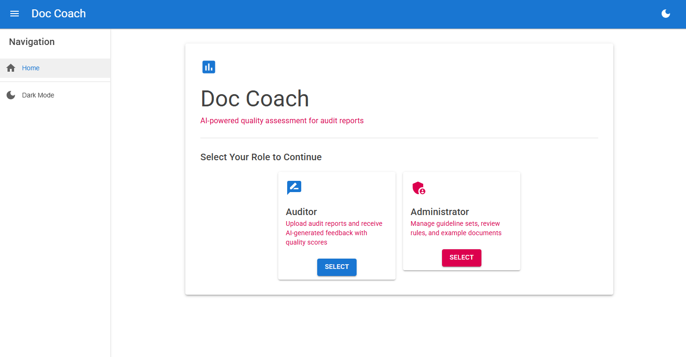
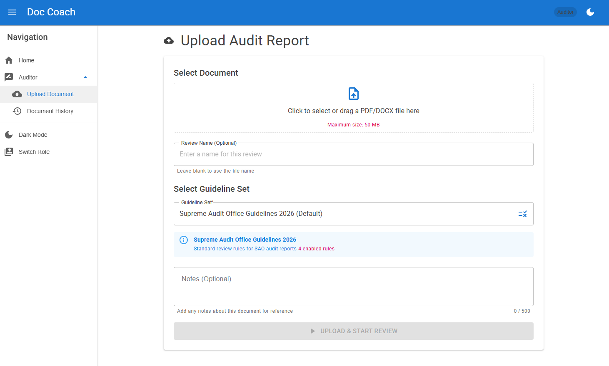
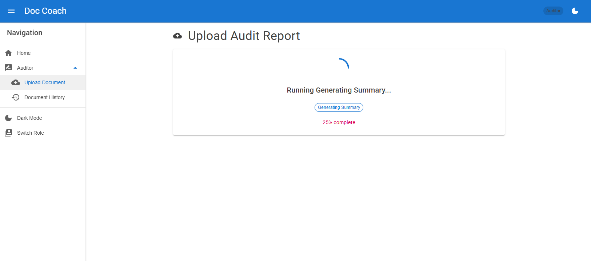
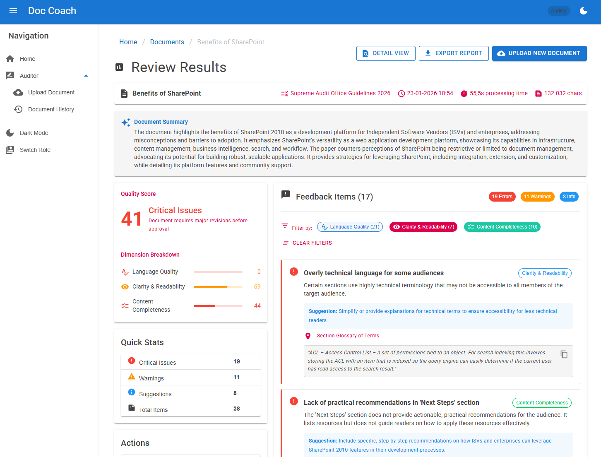
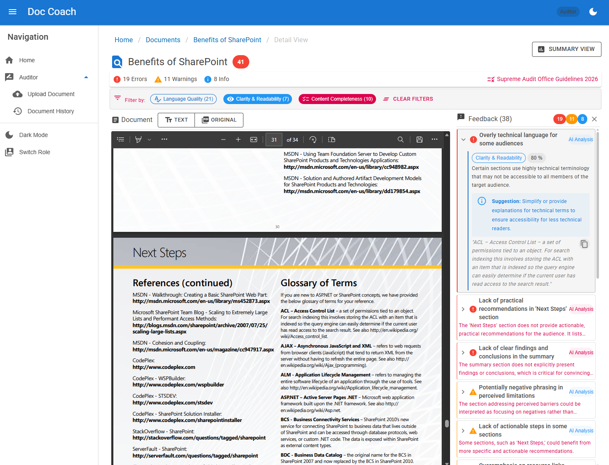
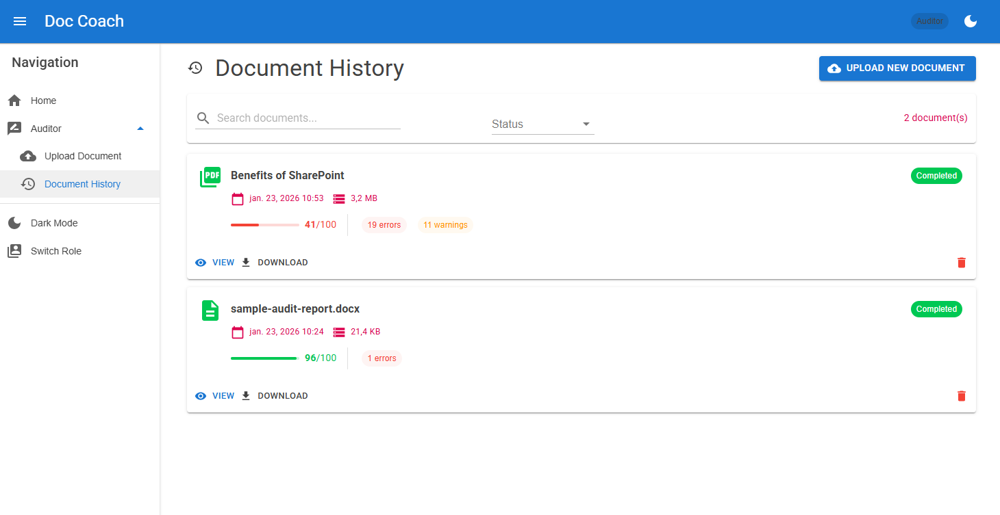
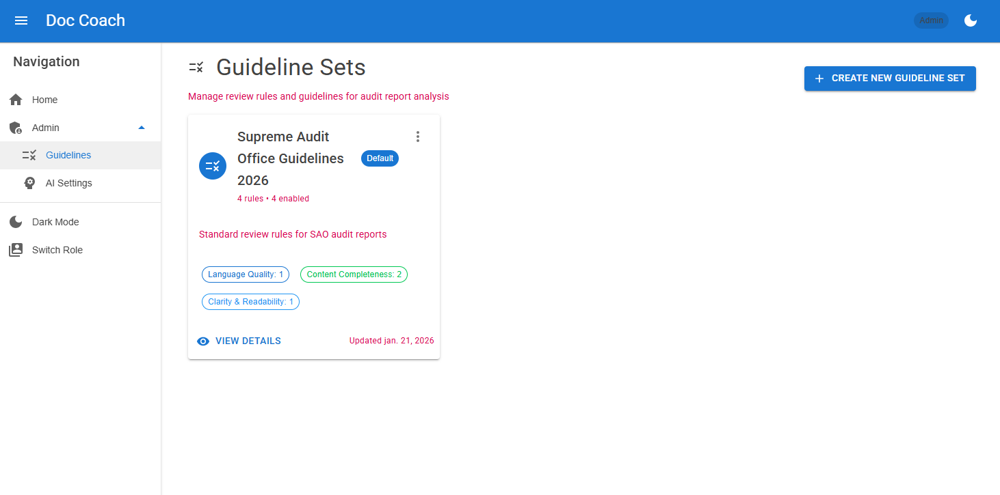
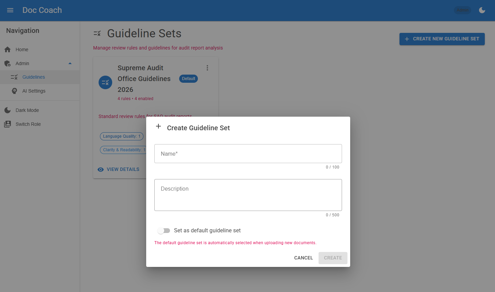
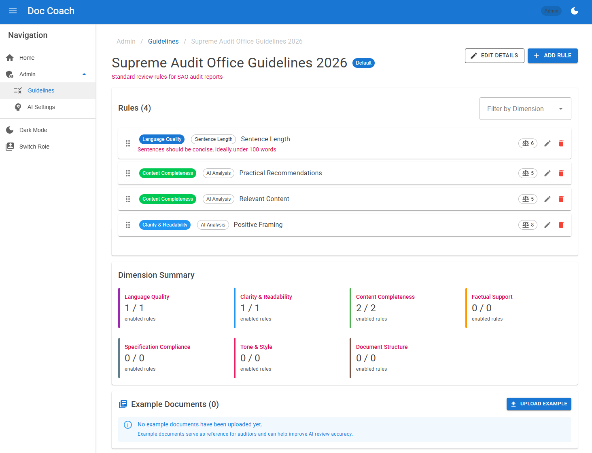
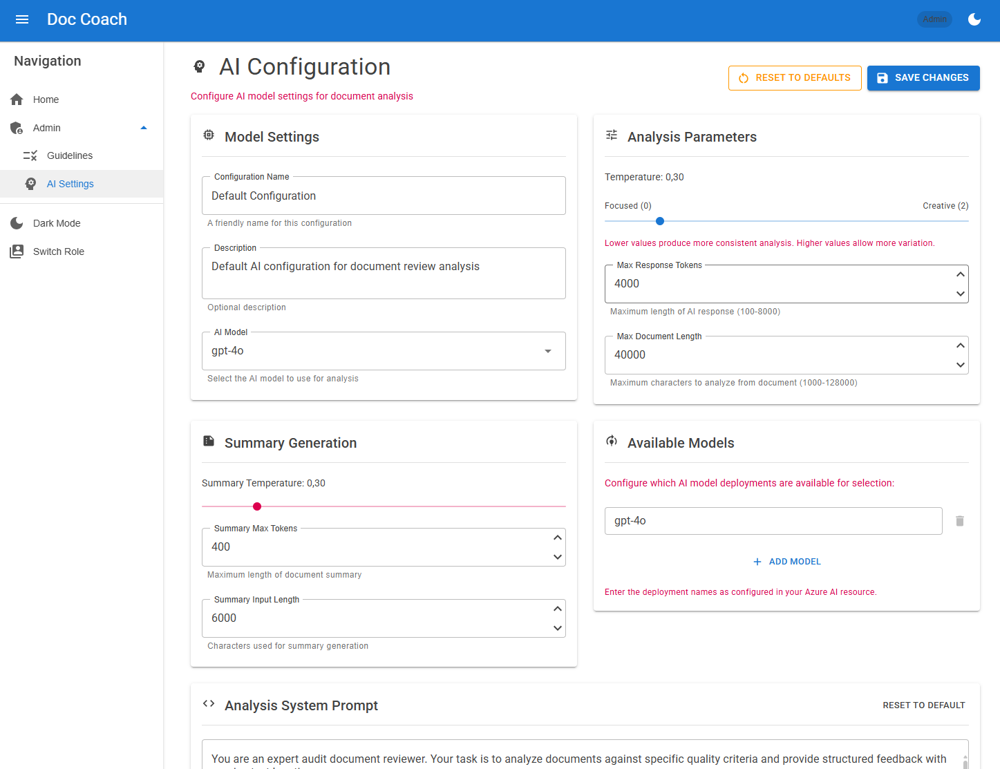

# DocCoach User Manual

DocCoach is an AI-powered document review tool designed to help auditors improve the quality of their audit reports. This manual covers all features for both Auditors and Administrators.

---

## Table of Contents

1. [Getting Started](#getting-started)
2. [Auditor Guide](#auditor-guide)
   - [Uploading Documents](#uploading-documents)
   - [Understanding Review Results](#understanding-review-results)
   - [Review Detail View](#review-detail-view)
   - [Document History](#document-history)
3. [Administrator Guide](#administrator-guide)
   - [Managing Guideline Sets](#managing-guideline-sets)
   - [Configuring Review Rules](#configuring-review-rules)
   - [AI Settings](#ai-settings)

---

## Getting Started

When you first open DocCoach, you'll see the home page where you select your role:

- **Auditor**: Upload audit reports and receive AI-generated feedback with quality scores
- **Administrator**: Manage guideline sets, review rules, and system configuration

Select your role to access the corresponding features.

---

## Auditor Guide

### Uploading Documents

To submit a document for review:

1. Navigate to **Upload** from the menu (or select the Auditor role from the home page)
2. Click the upload area or drag and drop a PDF or DOCX file (max 50 MB)
3. Optionally enter a **Review Name** to help identify this review later
4. Select a **Guideline Set** - this determines which rules are used to evaluate your document
5. Add any optional **Notes** for your reference
6. Click **Upload & Start Review**

The system will:
- Upload and store your document
- Extract text content
- Analyze the document against all enabled rules in the selected guideline set

### Understanding Review Results

After analysis completes, you'll see the Review Results page with:

- **Overall Score**: A percentage score based on all feedback
- **Dimension Scores**: Breakdown by category (Clarity, Accuracy, Completeness, Compliance, Style)
- **Feedback Summary**: Count of errors, warnings, and informational items

#### Feedback Severity Levels

| Icon | Severity | Description |
|------|----------|-------------|
| 🔴 | Error | Critical issues that must be addressed |
| 🟡 | Warning | Important issues that should be reviewed |
| 🔵 | Info | Suggestions for improvement |

### Review Detail View

Click **Detail View** to see feedback in context with your document text:

- **Left Panel**: Your document either in text mode or view mode
- **Right Panel**: List of all feedback items, filterable by dimension and severity

Click on any feedback item to:
- See the specific text that triggered the feedback
- Read the AI-generated suggestion
- Use browser search to find and highlight the section. There is a copy button to get the feedback excerpt

### Document History

Access **Document History** from the menu to see all your previous reviews:

- View past review scores and dates
- Re-open any review to see detailed feedback
- Track improvement over time

### Score Comparison

The **Score Comparison** feature allows you to track improvements across document versions:

- Review your **Document History** to see scores over time
- Compare the **Dimension Breakdown** between different reviews of the same document
- Use the **Compare Versions** button (coming soon) for side-by-side comparison

> **Note**: The full side-by-side comparison feature is under development. Currently, you can compare scores by viewing multiple reviews from Document History.

---

## Administrator Guide

### Managing Guideline Sets

Guideline sets define which rules are applied during document review. Navigate to **Guidelines** from the admin menu.

#### Creating a Guideline Set

1. Click **Create New Guideline Set**
2. Enter a **Name** and **Description**
3. Choose whether this should be the **Default** set
4. Click **Create**

#### Editing a Guideline Set

Click on a guideline set card to view its details and configure rules.

### Configuring Review Rules

Each guideline set contains rules organized by **Review Dimension**:

| Dimension | Purpose |
|-----------|---------|
| Clarity | Writing quality, readability, sentence structure |
| Accuracy | Factual correctness, consistency |
| Completeness | Coverage of required topics |
| Compliance | Adherence to standards and regulations |
| Style | Formatting, tone, professional language |

For each rule, you can:
- **Enable/Disable**: Toggle whether the rule is applied
- **Configure Parameters**: Adjust thresholds (e.g., maximum sentence length)
- **Set Severity**: Choose Error, Warning, or Info

### AI Settings

Configure AI-related settings from the **AI Settings** page:

- **Model Selection**: Choose which AI model to use for analysis
- **Temperature**: Adjust creativity vs. consistency of AI feedback
- **Token Limits**: Control response length

---

## Tips for Best Results

1. **Use appropriate guideline sets** - Different document types may benefit from different rule configurations
2. **Address errors first** - Focus on critical issues before tackling warnings
3. **Re-review after revisions** - Upload the revised document to verify improvements
4. **Use Score Comparison** - Track your progress across document versions

---

## Need Help?

If you encounter issues or have questions, contact your system administrator.
